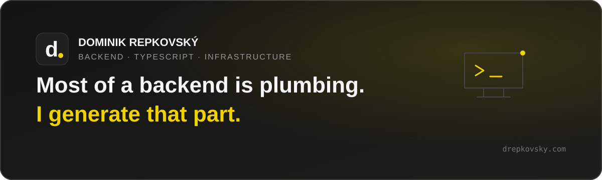

<p align="center">
  <a href="https://drepkovsky.com">
    
  </a>
</p>

<p align="center">
  Backend &amp; TypeScript · Bratislava, Slovakia
</p>

<p align="center">
  <a href="https://drepkovsky.com"><strong>Website</strong></a>
  &nbsp;·&nbsp;
  <a href="https://drepkovsky.com/work">Selected work</a>
  &nbsp;·&nbsp;
  <a href="https://questpie.com">QUESTPIE</a>
  &nbsp;·&nbsp;
  <a href="https://www.linkedin.com/in/drepkovsky/">LinkedIn</a>
  &nbsp;·&nbsp;
  <a href="mailto:dominik@questpie.com">Email</a>
</p>

---

I build production backends in TypeScript and run the servers they sit on. I
also wrote **[QUESTPIE](https://questpie.com)**, the open-source framework
underneath most of what I ship: define a schema once and get the database,
REST API, typed client, and admin out of it.

### Selected work

| Project | What it is |
| :--- | :--- |
| **[QUESTPIE](https://questpie.com/framework)** | A self-hosted TypeScript framework that generates the plumbing around a product from one schema. |
| **[Nutrimeals](https://drepkovsky.com/work/nutrimeals)** | A React Native ordering app and multi-tenant backend for smart canteens and connected fridges. |
| **[Jubli](https://drepkovsky.com/work/jubli)** | An event platform where guests join a live social space by scanning a QR code. |
| **[agent-board](https://github.com/questpie/agent-board)** | A local, Markdown-backed control plane for long-running coding-agent work. |

### How I work

- One schema should drive the API, types, admin, and client.
- You get a repository you can run, not a service you rent.
- I deploy to servers you can SSH into yourself.
- If a job needs a bigger team than mine, I say so.

`TypeScript` · `Bun` · `Node.js` · `Next.js` · `React Native` · `Postgres` ·
`Drizzle` · `Docker` · `Kubernetes` · `Linux`

> Available for contract work. If you have a product that needs a backend,
> **[tell me what you are building](mailto:dominik@questpie.com)**.

<details>
<summary><strong>About this repository</strong></summary>

This is the source for [drepkovsky.com](https://drepkovsky.com). It uses
Next.js 16 on the App Router and Tailwind CSS v4. The site is static except for
the contact route and is deployed to a self-hosted K3s cluster.

```bash
bun install
bun run dev
```

Copy `.env.example` to `.env.local` to enable the contact form. Without the
keys, the form falls back to a honeypot and rate limit and points visitors to
email instead.

```text
src/content/     every word on the site
src/app/         routes and API handlers
src/components/  shared interface components
```

Components never hold copy. If you are changing a sentence, it lives in
`src/content`.

Pushes to `main` are typechecked by Woodpecker, built into a commit-tagged
image, and deployed through the GitOps repository by Flux.

</details>
